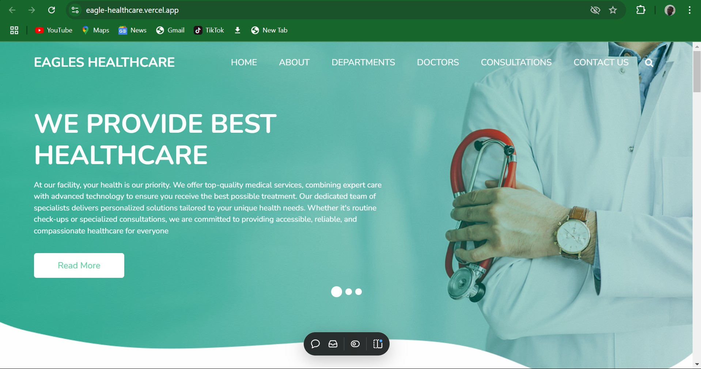

# Eagle HealthCare



Eagle HealthCare is an innovative platform designed to connect patients with doctors seamlessly through a user-friendly website. This README file provides an overview of the project, its key components, and how to set it up.

## Table of Contents

- [Introduction](#introduction)
- [Features](#features)
- [Technologies Used](#technologies-used)
- [Installation](#installation)
- [Usage](#usage)
- [Scaling Plans](#scaling-plans)
- [Security](#security)
- [Contributing](#contributing)
- [License](#license)

## Introduction

Eagle HealthCare aims to bridge the gap between patients and healthcare providers by offering a platform where patients can chat with an AI to get doctor recommendations. The project leverages cutting-edge technology to ensure data security and an efficient user experience.

## Features

- **AI Chat**: Patients can interact with an AI to get recommendations for doctors based on their needs.
- **Doctor Directory**: A comprehensive list of doctors available for consultation.
- **Medical Equipment Marketplace**: A future plan to enable the buying and selling of medical equipment.
- **Patient Tokenization**: Plans to tokenize patients for the services they receive, enhancing the healthcare experience.
- **Secure Data**: Utilizes ICP blockchain for secure patient data management.

## Technologies Used

- **Blockchain**: ICP blockchain for patient data security.
- **Authentication**: Oversimplified II for robust authentication.
- **Backend**: Typescript for backend services.
- **Frontend**: React for building the user interface.
- **AI**: For client consultation and redirection to appropriate departments.

## Installation

### Prerequisites

- Node.js
- NPM or Yarn
- ICP blockchain setup
- DFX toolchain

### Steps

1. Clone the repository:
    ```bash
    git clone https://github.com/your-username/eagle-healthcare.git
    ```
2. Navigate to the project directory:
    ```bash
    cd eagle-healthcare
    ```
3. Install dependencies:
    ```bash
    npm install
    ```
4. Start the ICP local network and clean any previous states:
    ```bash
    dfx start --background --clean
    ```
5. Deploy the backend:
    ```bash
    dfx deploy dfinity_js_backend
    ```
6. Start the development server:
    ```bash
    npm start
    ```

## Usage

1. Open your web browser and navigate to `http://localhost:3000`.
2. Create a patient account or log in.
3. Interact with the AI to get doctor recommendations.
4. Browse the list of doctors and choose a suitable one for consultation.
5. (Future) Buy and sell medical equipment.

## Scaling Plans

- **Medical Equipment Marketplace**: Implementation of a marketplace for buying and selling medical equipment.
- **Patient Tokenization**: Tokenizing patients for the services they receive, improving service efficiency and tracking.

## Security

Patient data security is of utmost importance. We use ICP blockchain to ensure all patient data is securely stored and managed. Authentication is handled via Oversimplified II to protect user accounts.

## Contributing

We welcome contributions! Please fork the repository and create a pull request with your changes.

## License

This project is licensed under the MIT License.
